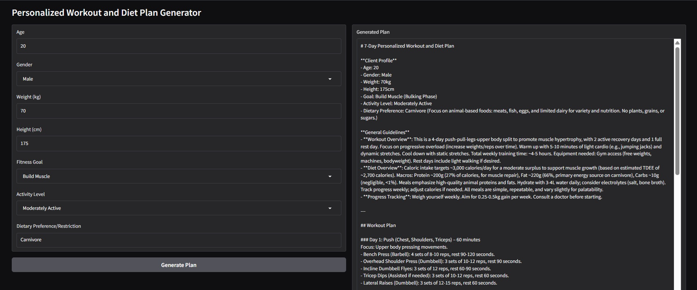

# Gen AI Fitness Assistant 💪🤖

A Gen AI-powered fitness assistant that generates personalized 7-day workout and diet plans using xAI Grok via OpenRouter. Features an intuitive Gradio web interface where users input their fitness profile to receive structured, tailored workout routines and nutrition plans designed for their individual goals and preferences.

## 📱 Application Screenshots

### Main Dashboard

*Clean web interface with user profile input, fitness goals selection, and comprehensive plan generation system*

## ✨ Features

### 💼 Core Functionality
- **Personalized Planning**: AI-generated 7-day workout and diet plans tailored to individual needs
- **Profile Analysis**: Comprehensive user profiling based on age, weight, height, and fitness goals
- **Goal-Oriented**: Customized plans for weight loss, muscle gain, endurance, or general fitness
- **Dietary Preferences**: Accommodation for vegetarian, vegan, keto, paleo, and other dietary needs

### 📊 AI Processing & Personalization
- **xAI Grok Integration**: Advanced AI analysis via OpenRouter for intelligent plan generation
- **Adaptive Recommendations**: Plans adjust based on activity level and fitness experience
- **Structured Output**: Well-organized workout routines with sets, reps, and rest periods
- **Nutrition Optimization**: Balanced meal plans with calorie and macro calculations

### 🎯 Plan Management
- **7-Day Structure**: Complete weekly workout and diet schedules
- **Exercise Variety**: Diverse workout types including strength, cardio, and flexibility
- **Meal Planning**: Breakfast, lunch, dinner, and snack recommendations
- **PDF Export**: Professional-quality plan documents for offline access

## 🛠️ Tech Stack


- **Backend**: Python with xAI Grok API integration via OpenRouter
- **Frontend**: Gradio web interface with responsive, user-friendly design  
- **AI Engine**: xAI Grok for intelligent fitness and nutrition plan generation
- **Export**: PDF generation for professional plan documentation
- **Processing**: Real-time plan creation based on user profile analysis

## 🚀 Installation & Setup

### Prerequisites
- Python 3.8 or higher
- OpenRouter API key with xAI Grok access
- Internet connection for AI processing

### Quick Start

1. **Clone the repository**
   ```bash
   git clone https://github.com/yourusername/plangenerator.git
   cd plangenerator
   ```

2. **Create virtual environment**
   ```bash
   python -m venv venv
   source venv/bin/activate  # On Windows: venv\Scripts\activate
   ```

3. **Install dependencies**
   ```bash
   pip install -r requirements.txt
   ```

4. **Configure API key**
   ```bash
   # Create .env file and add your OpenRouter API key
   echo "OPENROUTER_API_KEY=your_api_key_here" > .env
   ```

5. **Run the application**
   ```bash
   python app.py
   ```

## 📋 Requirements

```txt
gradio>=4.0.0
openai>=1.0.0
python-dotenv>=1.0.0
requests>=2.31.0
reportlab>=4.0.0
fpdf2>=2.7.0
pandas>=2.0.0
numpy>=1.24.0
```

## 🎯 Usage Guide

### User Profile Setup
1. Enter your **Age** (years)
2. Input your **Weight** (kg or lbs)
3. Specify your **Height** (cm or ft/in)
4. Select your **Fitness Goal** (Weight Loss, Muscle Gain, Endurance, General Fitness)
5. Choose your **Activity Level** (Sedentary, Lightly Active, Moderately Active, Very Active)

### Dietary Preferences
1. Select **Diet Type** (Omnivore, Vegetarian, Vegan, Keto, Paleo, Mediterranean)
2. Specify **Food Allergies** or restrictions
3. Set **Calorie Preferences** (Maintenance, Deficit, Surplus)
4. Choose **Meal Frequency** (3 meals, 5-6 small meals)

### Plan Generation
1. Click **Generate Fitness Plan** to create personalized recommendations
2. Review **7-Day Workout Schedule** with detailed exercises
3. Examine **Nutrition Plan** with meal suggestions and macros
4. Use **Export to PDF** to save your complete fitness plan


## 📁 Project Structure

```
plangenerator/
│
├── app.py                  # Main Gradio app
├── requirements.txt        # Python dependencies
├── .env                    # Store API key securely
├── utils/
│   ├── grok_generator.py   # xAI Grok API integration
│   └── pdf_export.py       # Export plan as PDF
└── README.md               # Project info
```


## 📊 Features Breakdown

### Fitness Plan Generation
- **Workout Customization**: Plans adapted to fitness level and available equipment
- **Progressive Structure**: Gradual intensity increase throughout the 7-day cycle
- **Exercise Variety**: Combination of strength training, cardio, and flexibility work
- **Rest Day Planning**: Strategic recovery periods for optimal results

### Nutrition Plan Creation
- **Macro Balancing**: Proper protein, carbohydrate, and fat ratios for goals
- **Calorie Calculation**: Precise caloric needs based on TDEE and goals
- **Meal Timing**: Optimal nutrition timing around workouts
- **Dietary Accommodation**: Full support for various dietary restrictions

### Export & Documentation
- **Professional PDFs**: Clean, printable fitness plans with structured layout
- **Weekly Overview**: Complete 7-day schedule at a glance
- **Shopping Lists**: Ingredient lists for meal preparation
- **Progress Tracking**: Built-in sections for recording workouts and measurements

## 🧪 Example Generated Plan

### Sample User Profile:
- **Age**: 28, **Weight**: 70kg, **Height**: 175cm
- **Goal**: Muscle Gain, **Activity**: Moderately Active
- **Diet**: Vegetarian, **Preference**: High Protein

### AI-Generated 7-Day Workout:
```
Day 1: Upper Body Strength
- Push-ups: 3 sets x 12-15 reps
- Pull-ups: 3 sets x 8-10 reps  
- Dumbbell rows: 3 sets x 10-12 reps
- Shoulder press: 3 sets x 10-12 reps

Day 2: Lower Body & Core
- Squats: 4 sets x 15 reps
- Lunges: 3 sets x 12 per leg
- Deadlifts: 3 sets x 10 reps
- Plank: 3 sets x 60 seconds
```

### Sample Nutrition Plan:
```
Breakfast: Greek yogurt with berries and granola (450 cal)
Lunch: Quinoa bowl with black beans and vegetables (520 cal)
Dinner: Lentil curry with brown rice (480 cal)
Snacks: Protein smoothie and nuts (300 cal)
Total: 1750 calories | 120g protein | 180g carbs | 65g fat
```

## 🤝 Contributing

1. Fork the repository
2. Create a feature branch (`git checkout -b feature/new-feature`)
3. Commit your changes (`git commit -m 'Add fitness tracking feature'`)
4. Push to the branch (`git push origin feature/new-feature`)
5. Open a Pull Request

## 🛡️ License

This project is licensed under the MIT License - see the [LICENSE](LICENSE) file for details.

## 🙏 Acknowledgments

- **xAI** for providing advanced Grok language model
- **OpenRouter** for seamless AI model API access
- **Gradio** for excellent web interface framework
- **Fitness Community** for workout and nutrition expertise

## 📈 Future Enhancements

- [ ] Progress tracking with photo uploads and measurements
- [ ] Integration with fitness wearables (Fitbit, Apple Watch)
- [ ] Social features for sharing plans and progress
- [ ] Video exercise demonstrations and tutorials
- [ ] Nutritional scanner for barcode-based meal logging
- [ ] AI coach chat for real-time fitness guidance
- [ ] Custom exercise database and plan modifications

---

**Built for your fitness journey with AI-powered personalization** 🏋️‍♀️

⭐ **Star this repository if it helps you achieve your fitness goals!**
